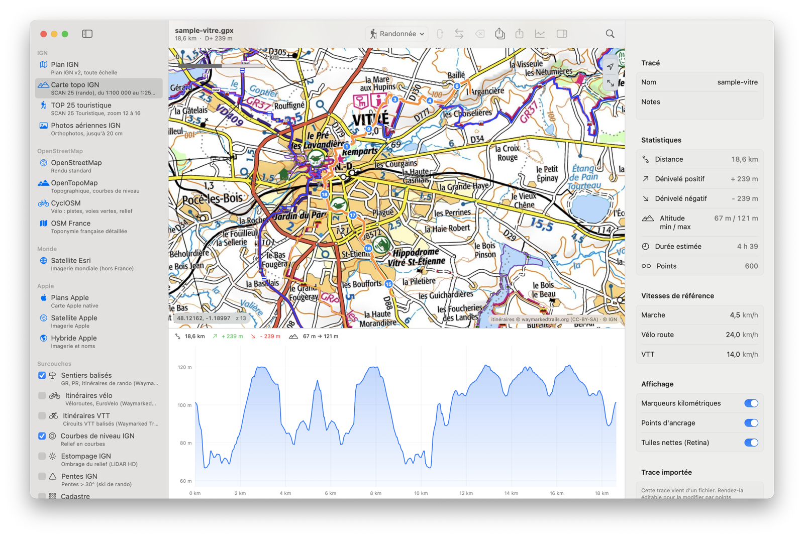

# Tracé

> Version française : [README.fr.md](README.fr.md)

   

A native GPX route editor for macOS (SwiftUI + MapKit). Plan hikes, road rides, gravel or MTB loops and runs, then export a clean GPX for your Apple Watch or any app. A local, native alternative to web route planners such as calculitineraires.fr, Visorando or gpx.studio: no account, no mandatory API key, no server of your own. Routing by BRouter, elevation by IGN, base maps by IGN and OpenStreetMap, all served for free at moderate use.



## Install

```bash
git clone https://github.com/charle-com/trace.git && cd trace
./build.sh --install     # requires Xcode; produces /Applications/Tracé.app (ad hoc signature)
```

The app is not notarized: on first launch, right-click the app and choose Open.

## Features

- **Draw by anchor points**: left-click adds a point, the route between two points is computed automatically (BRouter) according to the active mode: Hiking, Road bike, Gravel, MTB, Shortest, Car, Straight line.
- **Right-click on the map**: "Route to here (current mode)", "shortest", "straight line", "in… (other mode)", insert a point on the route, add a point of interest, close the loop, delete the last point, center the map, copy coordinates.
- **Editing**: dragging an anchor recomputes both adjacent legs; clicking on the line inserts an anchor; ⌥-click forces a straight line; ⌫ deletes the selected point (⌘⌥⌫ the last one); ⌘Z / ⇧⌘Z named undo and redo.
- **Changing the mode** (toolbar, ⌘⌥1 to ⌘⌥7) recomputes every leg of the route with that mode, as one undoable action; a single leg can still get its own mode from its context menu or the inspector.
- **Finishing a route**: Back to start (⌘L), Out and back (⇧⌘L), Reverse (⌘I), Recompute everything (⇧⌘R), Clear all (⇧⌘⌫).
- **Base maps** (sidebar, ⌘1 to ⌘9): IGN Plan v2, IGN aerial imagery, OpenStreetMap, OpenTopoMap, CyclOSM, OSM France, Esri satellite, Apple Maps standard / satellite / hybrid. IGN topographic map (SCAN 25) and TOP 25 through the shared Géoplateforme key `ign_scan_ws` (personal use; your own key can replace it in Settings). With a Thunderforest key: Outdoors, OpenCycleMap, Landscape (native Retina tiles).
- **Overlays**: waymarked hiking trails (GR, PR), cycling routes, MTB routes (Waymarked Trails), IGN contour lines, LiDAR HD hillshade, IGN slopes, cadastre.
- **Crisp tiles on Retina displays**: 2x2 assembly of the next zoom level (can be disabled), 2 GB disk cache.
- **Elevation**: IGN RGE ALTI (metre accuracy) with Valhalla then Open-Meteo as fallbacks; elevation profile synchronized with the map (hover = yellow dot on the route); smoothed ascent and descent (100 m window, 5 m hysteresis); estimated duration (hikers' rule, adjustable speeds).
- **Files**: the document is a standard `.gpx`. The project (anchors, modes) is embedded in `<metadata><extensions>`: reopenable and editable in Tracé, readable by any other app. Autosave, versions, iCloud Drive.
- **Automatic saving**: from the first point on, a file is created in `~/Documents/Tracés/` (folder configurable) and rewritten after every change; a named document is saved silently. Can be disabled in Settings.
- **Import**: open any GPX (Garmin, Strava, Komoot…); "Make editable" converts the track into anchors; missing elevations are filled in. The original file is never rewritten: edits go to a copy named `<name> (Tracé).gpx` in the routes folder.
- **Export** (⇧⌘E): clean GPX for the Apple Watch (track or route, elevations, points of interest, Douglas-Peucker simplification); the Share button sends it by AirDrop to your iPhone.
- **Search**: search field (place, address, or "lat, lon"), My location (⌘⌥L), Fit to route (⌘⏎), kilometre markers (⌘K).

## Build

```bash
./build.sh            # release, build/Tracé.app
./build.sh --debug    # debug build
./build.sh --install  # copies to /Applications
swift test            # core tests (DEVELOPER_DIR=/Applications/Xcode.app/Contents/Developer)
```

Requires the Xcode toolchain; there is no Xcode project, everything goes through SwiftPM. Ad hoc code signature.

## Automated QA

`./qa.sh <folder> --scenario route|gestures|open [--open file.gpx] [--layer id] [--overlay a,b] [--profile raw]`
Launches the app in `--qa` mode, runs the scenario (clicks, menus, drag, undo, export), captures the window (`window.png` when the screen is unlocked, `window-cache.png` otherwise) and writes `result.json`, `export.gpx` and `work.gpx`.

## Data sources (verified 2026-08-30)

| Purpose | Service | Notes |
|---|---|---|
| Routing | `brouter.de/brouter` (fallback `bikerouter.de`, then OSRM by FOSSGIS) | no key, elevation included; Hiking = `hiking-mountain` + `profile:shortest_way=1` (true shortest path on foot), "prefer waymarked trails" option in Settings |
| Elevation | IGN Géoplateforme `altimetrie/1.0/calcul/alti/rest/elevation.json` | JSON POST, 5,000 points max, `-99999` nodata interpolated; fallback Valhalla `/height`, then Open-Meteo |
| IGN base maps | `data.geopf.fr/wmts` (open) | Plan IGN v2, aerial imagery, contours, hillshade, slopes, cadastre: Etalab open licence |
| SCAN 25 | `data.geopf.fr/private/wmts?apikey=ign_scan_ws` | shared key published by IGN during the Géoplateforme migration, moderate personal use, may be revoked without notice; a personal key (cartes.gouv.fr account, free for professional or non-profit use) can replace it in Settings |
| OSM | tile.openstreetmap.org, OpenTopoMap (max z17), CyclOSM (max z17), OSM France | identifying User-Agent required, no bulk download |
| Trails | tile.waymarkedtrails.org | hiking / cycling / mtb overlays |

## License

MIT for the code. Map tiles and services remain subject to their own terms (IGN Géoplateforme, OpenStreetMap, OpenTopoMap, CyclOSM, Waymarked Trails, BRouter, FOSSGIS): moderate personal use, no mass download.

## Project layout

- `Sources/TraceCore`: geometry (haversine, Douglas-Peucker, tile maths), GPX reader/writer, project model (anchors, legs, POIs), statistics and profile. Covered by `Tests/TraceCoreTests`.
- `Sources/Trace/Model`: document (`ReferenceFileDocument`, undo, autosave), service protocols.
- `Sources/Trace/Services`: `RoutingHub` (BRouter + fallbacks + cache), `ElevationHub` (IGN + fallbacks + cache).
- `Sources/Trace/Map`: `MapView` (MKMapView, gestures, context menu, annotations, polylines), `TileOverlay` (tiles + Retina assembly), `LayerCatalog`, `MapSettings`.
- `Sources/Trace/Views`: window (split view, inspector, toolbar), sidebar, elevation profile, export sheet, menus, settings.
- `Sources/Trace/QARunner.swift`: `--qa` mode.
